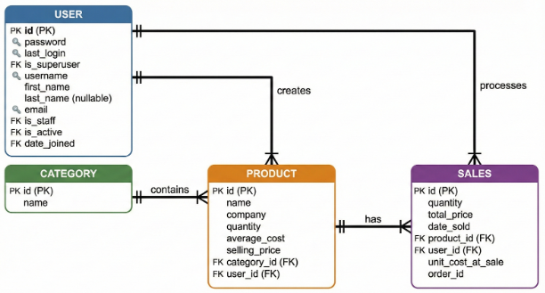
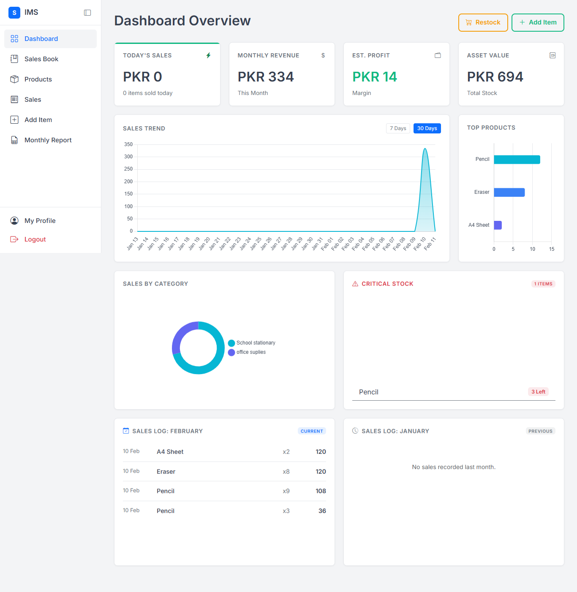

# 📦 Inventory Management System (IMS)

> A full-featured Django web application for automating inventory control, sales processing, and business analytics for retail operations.

---


---

## 🎯 Project Overview

The **Inventory Management System (IMS)** is a comprehensive web-based solution designed to digitize and streamline inventory operations for small to medium-sized retail businesses. Built with modern web technologies and following industry-standard software engineering principles, this system addresses the inefficiencies of manual record-keeping by providing real-time inventory tracking, automated sales processing, and actionable business insights.

### 💡 Problem It Solves

Traditional manual inventory systems suffer from:
- **Data inconsistency** and human errors in record-keeping
- **Stock mismanagement** leading to overstock or stockouts
- **Lack of real-time visibility** into inventory levels and sales performance
- **Time-consuming manual calculations** during sales transactions
- **Absence of analytical insights** for informed decision-making

### 🎯 Who It's For

- Small retail businesses seeking affordable digital transformation
- Store managers needing centralized inventory control
- Business owners requiring real-time sales analytics
- Operations teams looking to eliminate manual paperwork

### ✨ Why It Matters

This system reduces operational costs, minimizes errors, improves stock accuracy, and empowers businesses with data-driven insights—all through an intuitive, user-friendly interface that requires no technical expertise.

---

## 🚀 Key Features

### Core Functionality
- ✅ **User Authentication & Authorization** — Secure login system with role-based access control
- 📊 **Complete Inventory Management** — Full CRUD operations for products, categories, and stock levels
- 🛒 **Point of Sale (POS)** — Streamlined sales transactions with automatic calculations and receipt generation
- 📈 **Real-Time Analytics Dashboard** — Visual insights into sales trends, inventory status, and business performance
- 🔍 **Search & Filter** — Advanced product search and category-based filtering
- 📋 **Stock Level Monitoring** — Automatic low-stock alerts and inventory status tracking
- 🧾 **Sales History & Reporting** — Comprehensive transaction logs and exportable reports
- 🔐 **Data Integrity** — Database constraints and validation ensuring data accuracy

### Technical Highlights
- Layered architecture for maintainability and scalability
- Normalized database design following best practices
- Responsive UI compatible with desktop, tablet, and mobile devices
- RESTful design patterns for clean API structure

---

## 🛠️ Tech Stack

### Backend
- **Python 3** — Core programming language
- **Django** — High-level web framework for rapid development
- **SQLite** — Lightweight relational database for data persistence

### Frontend
- **HTML5 & CSS3** — Semantic markup and modern styling
- **Bootstrap 5** — Responsive design framework
- **JavaScript** — Dynamic client-side interactions

### Development Tools
- **Visual Studio Code** — Primary IDE
- **Git & GitHub** — Version control and collaboration
- **Django ORM** — Object-relational mapping for database operations

---

## 🏗️ System Architecture

The IMS follows a **3-tier layered architecture** designed for separation of concerns and code maintainability:

```
┌─────────────────────────────────┐
│   Presentation Layer (UI)       │  ← User Interface (Templates, Static Files)
├─────────────────────────────────┤
│   Business Logic Layer          │  ← Views, Forms, Validators
├─────────────────────────────────┤
│   Data Access Layer (ORM)       │  ← Models, Database Queries
└─────────────────────────────────┘
```

This architectural approach ensures:
- **Maintainability** — Changes to one layer don't cascade to others
- **Scalability** — Easy to extend functionality without refactoring
- **Testability** — Each layer can be tested independently
- **Reusability** — Business logic can be reused across different interfaces

---

## 🗄️ Database Design

The system uses a **normalized relational database** with four primary entities:

### Core Entities
- **User** — Manages authentication, roles, and system access control
- **Category** — Organizes products into logical classifications
- **Product** — Stores comprehensive inventory details (name, price, quantity, cost, etc.)
- **Sales** — Records transaction history, updates stock levels, and tracks revenue

### Entity Relationships
- User → Product (One-to-Many): *Users create and manage products*
- User → Sales (One-to-Many): *Users process sales transactions*
- Category → Product (One-to-Many): *Categories contain multiple products*
- Product → Sales (One-to-Many): *Products can appear in multiple sales*

### ERD Diagram


*The ERD ensures proper normalization, referential integrity, and efficient query performance.*

---

## 📥 Installation & Setup

### Prerequisites
- Python 3.8 or higher
- pip package manager
- Git

### Step-by-Step Installation

1️⃣ **Clone the Repository**
```bash
git clone https://github.com/SyedAteebJilani/IMS-Django-Project.git
cd IMS-Django-Project
```

2️⃣ **Create Virtual Environment** *(Recommended)*
```bash
python -m venv venv
source venv/bin/activate  # On Windows: venv\Scripts\activate
```

3️⃣ **Install Dependencies**
```bash
pip install -r requirements.txt
```

4️⃣ **Apply Database Migrations**
```bash
python manage.py migrate
```

5️⃣ **Create Superuser Account**
```bash
python manage.py createsuperuser
```

6️⃣ **Run Development Server**
```bash
python manage.py runserver
```

7️⃣ **Access the Application**
- Open your browser and navigate to: `http://127.0.0.1:8000/`
- Admin panel: `http://127.0.0.1:8000/admin/`

---

## 💻 Usage Guide

### For Store Managers
1. **Login** using your credentials
2. **Add Products** via the Inventory section with details like name, category, price, and quantity
3. **Process Sales** through the POS interface by selecting products and generating receipts
4. **Monitor Stock** levels and receive low-stock alerts
5. **View Analytics** on the dashboard for sales trends and inventory insights

### For Administrators
- Manage user accounts and permissions
- Configure product categories
- Access comprehensive sales reports
- Monitor system activity and data integrity

### Workflow Example
```
Login → Dashboard Overview → Inventory Management → Add/Edit Products 
→ POS Transaction → Receipt Generation → Updated Analytics
```

---

## 📸 Screenshots

### Dashboard Analytics



*Real-time business metrics and sales performance visualization*

### Inventory Management

*Complete product listing with search, filter, and CRUD operations*

### Point of Sale Interface

*Streamlined sales processing with automatic calculations*

### Product Details

*Comprehensive product information and stock tracking*

### Sales History

*Transaction logs with filtering and export capabilities*

---

## 🎥 Demo

### 🌐 Live Demo
**Coming Soon** — Deployment in progress

### 📹 Video Walkthrough
[Watch Full Demo on YouTube](https://www.youtube.com/placeholder) *(Coming Soon)*

---

## 🗺️ Roadmap & Future Enhancements

### Planned Features
- [ ] **Multi-Store Support** — Manage inventory across multiple retail locations
- [ ] **Advanced Analytics** — Predictive inventory forecasting and trend analysis
- [ ] **Barcode Scanning** — Integrate barcode readers for faster product lookup
- [ ] **Accounting Integration** — Sync with QuickBooks, Xero, or other accounting software
- [ ] **Mobile App** — Native iOS/Android apps for on-the-go inventory management
- [ ] **Supplier Management** — Track vendors, purchase orders, and reorder points
- [ ] **Multi-Currency Support** — Handle international sales and pricing
- [ ] **Email Notifications** — Automated alerts for low stock, sales milestones, etc.
- [ ] **API Development** — RESTful API for third-party integrations
- [ ] **Cloud Deployment** — Production-ready hosting on AWS/Azure/Heroku

### Technical Improvements
- [ ] PostgreSQL migration for production environments
- [ ] Redis caching for performance optimization
- [ ] Celery for asynchronous task processing
- [ ] Docker containerization
- [ ] Comprehensive unit and integration testing

---

## 👨‍💻 Author

**Ateeb Jilani**

[](https://github.com/SyedAteebJilani)
[](https://linkedin.com/in/your-profile)
[](mailto:your.email@example.com)

*Software Engineer passionate about building practical solutions that solve real-world business problems.*

---

## 📄 License

This project is licensed under the **MIT License** — see the [LICENSE](LICENSE) file for details.

---

## 🙏 Acknowledgments

- Django documentation and community
- Bootstrap team for the responsive framework
- Open-source contributors whose libraries made this possible

---

## 🤝 Contributing

While this is a personal portfolio project, suggestions and feedback are welcome! Feel free to:
1. Fork the repository
2. Create a feature branch (`git checkout -b feature/AmazingFeature`)
3. Commit your changes (`git commit -m 'Add some AmazingFeature'`)
4. Push to the branch (`git push origin feature/AmazingFeature`)
5. Open a Pull Request

---

## 📞 Support

If you encounter any issues or have questions:
- Open an [issue](https://github.com/SyedAteebJilani/IMS-Django-Project/issues)
- Contact via email (see Author section)

---

<div align="center">

**⭐ Star this repository if you found it helpful!**

Made with ❤️ and Django

</div>
